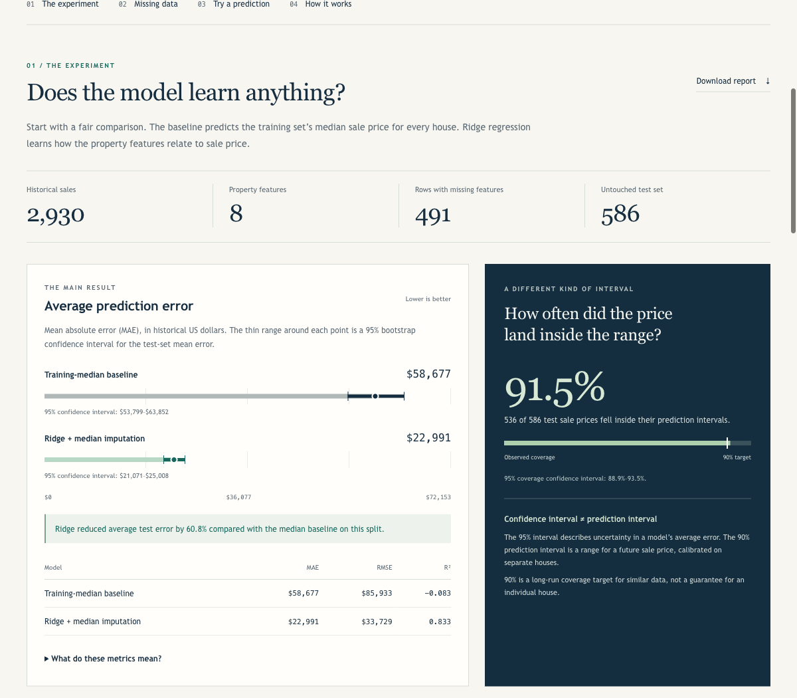

# Sprint Lead Generation

A local Flask workspace for property research, lead prioritization, and outreach tracking. The **Property ML Lab** adds an educational housing-price experiment with real missing data and explicit uncertainty.



## Run the Property ML Lab

Python 3.12 or newer is required by the pinned ML packages; the checked-in experiment was run with Python 3.13.

```bash
python3 -m venv .venv
.venv/bin/python -m pip install -r requirements-ml.txt
.venv/bin/python scripts/train_property_ml.py --download
.venv/bin/python app.py
```

Open [Property ML Lab](http://127.0.0.1:5001/ml-lab), or use the link in the Sprint header. The app uses port 5001 by default. The first lab visit trains the small experiment locally; subsequent requests reuse it. After the initial dataset download, the lab works offline and needs no API keys. The main lead workspace has its own data-source settings.

On macOS, after setup you can also double-click `start_ml.command`.

## What the project demonstrates

- **Real data:** 2,930 historical Ames, Iowa home sales from Dean De Cock's published teaching dataset.
- **Missing values:** keep unknown measurements separate from genuine zeros, learn median replacements on training data, and add missing-value indicators.
- **Supervised regression:** compare a training-median baseline with a small Ridge regression model using eight understandable property features.
- **Honest evaluation:** split training, interval-calibration, and final test data before fitting; compare models on the same test cohort.
- **Confidence intervals:** bootstrap a 95% interval for mean absolute error (MAE), conditional on the fitted model.
- **Prediction intervals:** construct a separate 90% split-conformal interval for an individual historical-style home and measure its held-out coverage.
- **Reproducibility:** fixed split and bootstrap seeds, pinned ML dependencies, source checksum, downloadable report, and automated tests.

The lab is a historical learning benchmark. It does not estimate current Georgia property prices or predict seller conversion. Sprint's operational lead scores remain separate from the regression model. A learned conversion model would need observed outreach outcomes and a defined observation period.

## Walk through the experiment

1. Open the lab and compare the baseline's error with Ridge's error and confidence interval.
2. Inspect the missing-data table, then clear a field in the home example to see exactly which training median fills it.
3. Generate a prediction and explain why its prediction interval answers a different question from the MAE confidence interval.
4. Read the [research and methodology](docs/ML_RESEARCH.md), [interview demo guide](docs/ML_DEMO_GUIDE.md), and [executed notebook](notebooks/property_ml_walkthrough.ipynb).

The generated [experiment report](reports/ml_report.json) contains the measured results and data provenance. Rebuild it with the training command above.

## Measured result

One fixed experiment: 1,758 training, 586 calibration, and 586 test sales.

| Model | Test mean absolute error | 95% bootstrap confidence interval |
| --- | ---: | ---: |
| Training-median baseline | $58,677 | $53,799–$63,852 |
| Ridge with median imputation | $22,991 | $21,071–$25,008 |

The separate 90% prediction interval has a shared radius of about $46,924 and covers 536 of 586 test prices (91.5%). These are historical benchmark results, not a current valuation accuracy claim. On the 493 complete test records, complete-case training and imputation have nearly identical MAE; imputation's clear benefit here is retaining 309 additional training rows and supporting the 93 incomplete test records.

## Tests

```bash
.venv/bin/python -m pip install pytest
.venv/bin/python -m pytest -q
```

The tests cover data separation, imputation, interval calculations, input validation, optional-dependency failures, and the existing lead workflow. The lab loads its ML dependencies only when used, so the original workspace can still run with `requirements.txt` alone.

## Data provenance

Source: [De Cock (2011), *Ames, Iowa: Alternative to the Boston Housing Data as an End of Semester Regression Project*](https://jse.amstat.org/v19n3/decock.pdf). The download script retrieves the [original tab-separated data](https://jse.amstat.org/v19n3/decock/AmesHousing.txt). Downloaded data is ignored by Git; no lead database, private exports, credentials, or serialized executable model is included in the ML feature commit. See the research notes for source-use and statistical limitations.
